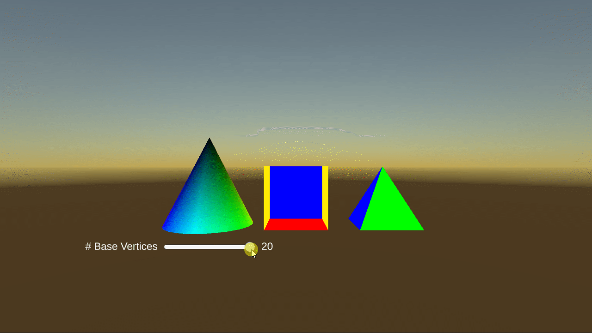
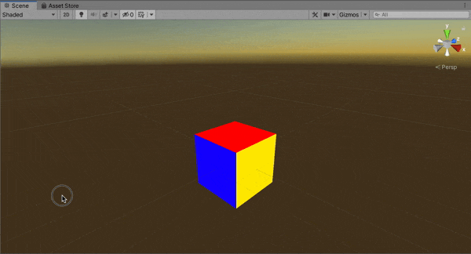

**The University of Melbourne**

# COMP30019 – Graphics and Interaction

## Workshop 2: Polygonal Geometry

  

  

### Overview

In this workshop you will learn about polygonal geometry, and the internal data structures that 
represent the _shape_ of three-dimensional objects, often known as *meshes*. To begin, clone this repository and open
it in Unity as shown last week.
You'll be working with the following assets today:

* **MainScene.unity** - The scene you should open and work with for the entire workshop.
* **GenerateCube.cs** - A custom component that generates a cube mesh when the 
"game" starts.
* **VertexColorShader.shader** - A Cg/HLSL shader used to render the cube using simple 
vertex colours. Don't worry about understanding this file in detail today -- you'll learn more about
shaders later in the semester.
* **VertexColorMaterial.mat** - A material asset that utilises the above shader
to draw the cube's surface.

### Tasks

#### 1. Explore the scene

Open `MainScene.unity` in the editor. Press the ‘Play’ button and you should see a
*partially* rendered cube. Switch to the ‘Scene’ tab so you can manually 
[navigate the scene](https://docs.unity3d.com/Manual/SceneViewNavigation.html).
Use the ‘scene gizmo’ located in the top-right of the viewport in
order to select different angles to view the cube from. Which two faces are
missing?

> **Note** 
> You might notice this cube is not visible except during play mode. This is because 
> the cube mesh is 
> *generated* upon starting the scene. This is done inside the `GenerateCube.cs` component,
> which you'll modify shortly.

#### 2. Turn on culling

Open `VertexColorShader.shader`, remove the code `Cull Off`, and save the
file. Make sure you keep this code removed for the remainder of the workshop.
Examine the cube again in the Unity editor. What did `Cull Off` do?

#### 3. Complete the cube

Add vertex definitions to `GenerateCube.cs` to complete the cube (add the
missing faces). Culling is now on, so make sure you use the correct vertex
*winding order* such that the triangles you define are visible from the outside
of the cube. Don't forget to also add corresponding vertex colour definitions, which you should set
to `Color.blue`.

  

#### 4. Create a pyramid

In a file called `GeneratePyramid.cs`, write a component that generates an upward
facing square pyramid. The tip of the pyramid should be located
at `(0.0, 1.0, 0.0)`, and each face should have a 
unique [colour](https://docs.unity3d.com/ScriptReference/Color.html)
of your choosing. This will be very similar logically to the cube generator script, so you are 
welcome to use it as a template. 

> **Note** 
> Writing the new component alone is not sufficient to render the pyramid. You also need to
> attach it to a new game object with two other built-in components:
> * A [Mesh Filter](https://docs.unity3d.com/Manual/class-MeshFilter.html)
> component that will be populated with the generated mesh when the game starts. 
> * A [Mesh Renderer](https://docs.unity3d.com/Manual/class-MeshRenderer.html) 
> component to actually draw the object. Recall from
> last week that a _material_ is associated with the mesh renderer to
> define how the object's surface should be drawn. 
> In this case, you'll want to assign the existing `VertexColorMaterial.mat` asset
> so that vertex colour definitions in your *mesh* are utilised as part of the rendering process.

If you are stuck, you might find it helpful to use the existing **Cube** game object as a guide!
Remember that the mesh filter/renderer combination is incredibly common in Unity, as most objects have a shape (`MeshFilter`),
and there needs to be a way of describing the surface of that shape before it can be drawn (`MeshRenderer` with an assigned *material*). 
You might notice that the mesh filter not just represents the shape but also contains colour data, and that seemingly
contradicts this notion. However this is just per-vertex _data_ -- it is the mesh renderer, and ultimately the
corresponding shader, which *interprets* this data as actual colours that should be drawn. Another material
might interpret vertex "colours" in an entirely different way, or ignore them altogether. If this is confusing,
don't worry! You'll learn more about shaders and materials in a few weeks.

  

#### 5. Reverse the vertex winding order

Move the scene view camera _inside_ the cube. Since back-face
culling is on, you won’t be able to see the inside faces of the cube. Modify
the indices in `GenerateCube.cs` so
that you can see the interior of the cube instead of the exterior. Carefully read 
the associated code comments as these provide some more context about what
the indices actually represent (the indices are defined in step 3, near the end of the file).
Can you think of another way to do this that doesn't involve changing the indices?

  

#### 6. Generate a cone (challenge)

Constructing meshes by manually defining vertices/colours is tedious and rarely done
in practice (phew!). So far we've only asked you to do this so that you understand the 
internal data structures required to define a mesh.
Nonetheless, the ability to generate a mesh using C# scripting is far from useless if
we want to _procedurally generate_ a mesh that is parameterised in some way.

For an extra challenge, try to write a script to procedurally generate a cone. Use
serialized (or public) class attributes to allow parameters of the cone to be set from the
editor, such as the radius. Hint: You can think of a cone as a generalisation
of the pyramid you manually defined in this workshop. The vertices of the base
will form a _circle_ rather than a square, and there’ll be one vertex for the
tip. [Maths functions](https://docs.unity3d.com/ScriptReference/Mathf.html) 
like `Mathf.Sin` and `Mathf.Cos` should help.

  
  

#### 7. Search for and import a 3D model (extension)

In practice, there are artists in a game dev team who use [3D modelling](https://en.wikipedia.org/wiki/3D_modeling) tools
to design _models_ in the scene ([Blender](https://www.blender.org/) is worth checking out if you
are interested in trying this for yourself). These can be saved using various file
formats, many of which can be directly imported by the Unity engine as pre-fabricated game objects. 
This means writing code to define the shape 
of an object is not necessary at all! 

> **Note**  
> A model may be more complex than just a mesh.
> Ultimately, meshes alone cannot capture the complexity of some objects -- for example, how
> they might be animated, or some of the surface properties (e.g. materials).

As a final extension exercise, 
search the web for some models and try 
to [import them](https://docs.unity3d.com/Manual/ImportingModelFiles.html) into
your Unity project. Models with the _.fbx_ format are generally well handled
by Unity, but there are other formats work well too. 

> **Warning** 
> Always keep in mind
> copyright and licensing when including external resources in your projects –
> there are many freebies out there, but licenses may prohibit usage
> under certain circumstances (i.e. commercial uses). 

Remember, it's a great idea to challenge yourself beyond what we explicitly discuss in class. 
For example, see if you can import
a model, but then also "distort" it in some way by accessing the underlying mesh in a 
C# script (e.g. modify the vertex definitions). 
You may need to do some additional research in order to do this, but the building blocks of mesh
data structures have been demonstrated in this class. 

Feel free to reach out on Ed if you have any questions, and most importantly, have fun!
